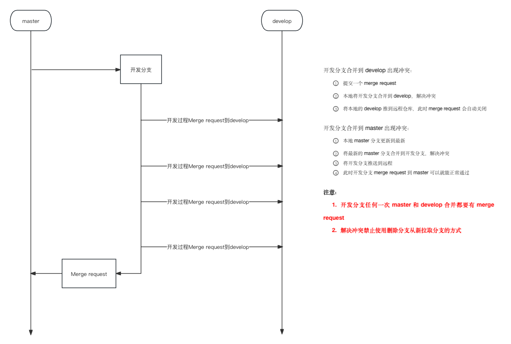
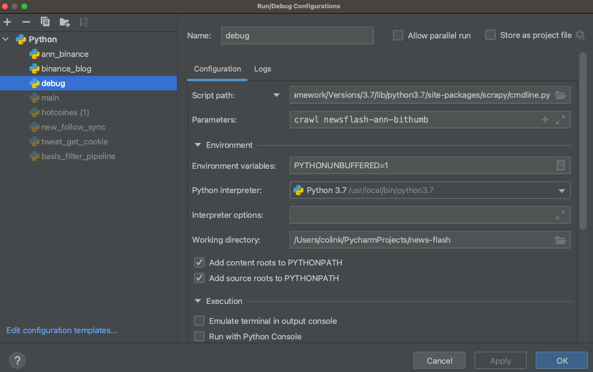
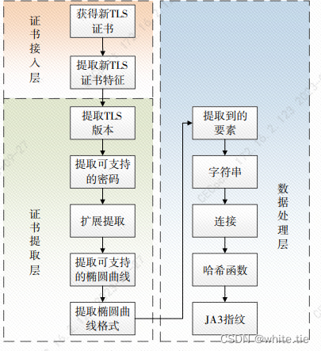

# 笔记本

- [Git常用操作](#section1)
- [Mac快捷键](#section2)
- [代理设置](#section3)
- [Xpath语法](#section4)
- [Scrapy](#section5)
  - [在pycharm的调试实现](#section5-1)
  - [scrapy中的xpath](#section5-2)
  - [对应关系](#section5-3)
- [mongodb](#section6)
- [Redis](#section7)
  - [常用命令](#section7-1)
  - [爬虫去重用法](#section7-2)
  - [过期设置](#section7-3)
    - [setex()](#section7-3-1)
    - [expire()](#section7-3-2)
- [设计模式](#section8)
- [浅拷贝和深拷贝](#section9)
  - [浅拷贝](#section9-1)
  - [深拷贝](#section9-2)
- [DNS解析](#section10)
- [asyncio异步](#section11)
- [多线程](#section12)
   - [异步与多线程区别](#section12-1)
- [单例模式](#section13)
  - [使用案例](#section13-1)
  - [多例模式](#section13-2)
- [时间操作](#section14)
  - [获取标准格式](#section14-1)
  - [string转时间戳](#section14-2)
- [SQL注入](#section15)
  - [1、escape_string() 转义](#section15-1)
  - [2、cursor.execute()参数化](#section15-2)
  - [安全的方式](#section15-3)
- [TLS指纹](#section16)

## Git常用操作：
1、先将远程仓库clone到本地：在本地目标文件夹打开终端/在终端cd到目标文件夹，执行git clone “远程的ssh/https地址”

2、在开发工具pycharm的 ‘File’ —》‘Open’ 中打开刚克隆的项目文件

3、新建分支（‼️在本地master分支基础上新建，新建分支前update本地master同步远程master代码‼️）并切换到该分支（pycharm点点点，过程填写分支名（分支名：‘fix-xxx-xxx’），相当于 git checkout -b ‘fix-xxx-xxx’）

4、编辑修改代码

5、 在pycharm的commit视图勾选需要提交并推送到远程仓库的文件，
	填写commit message解释提交的信息（fix：修复/优化xxx逻辑；feat：新增xxx模块/功能）

6、点击commit，然后push到远程仓库（因为前面clone过已建立连接，否则需要先确定本地和远程仓库的对象，
	并且push后远程仓库自动创建对应分支，类似具有自动跟踪）
      （这里5和6介绍都是在pycharm上操作, 相当于git add.     git commit -m 和 git push，pycharm操作更直观方便）

7、在gitlab/github平台，点击Merge requests（后续简称MR）
	选择好Source branch和Target branch分别创建两个MR（填写MR title和解释具体操作内容、创建者）
	一个合并到develop分支，用于测试，自行通过合并请求，不用指定reviewer，创建过程不要勾选删除源分支选项
	一个合并到master分支，待上线，需要指定reviewer人员，待reviewer审批MR，创建过程勾选“如果通过commit即删除源分支”选项

8、在没Merge requests没成功Merge之前，可继续在本地分支修改代码并提交推送到远程对应分支即可

9、删除本地分支git branch -d/D xxx-xxx
	删除远程分支git push origin --delete xxx-xxx


### Mac快捷键： 
- [ ] command+空格：聚焦搜索
- [ ] command+shift+g：通过路径打开目标所在文件夹
- [ ] command+shift+4/5:高级截图
- [ ] command+shift+f：pycharm全局搜索
- [ ] command+option+ <：pycharm返回调用位置

### 代理设置 
      1、全局代理：
      Wi-Fi —》网络偏好设置 —〉高级 —》 代理 —〉网页代理/安全网络代理 —> 配置域名和端口
      2、Google 网页插件（仅Google浏览器代理）：
      插件商店 —》安装proxy switchyomega插件 —> 配置域名和端口 —>选择打开模式
      3、python终端：
      Terminal —》export http_proxy=http://px-local.sosobtc.com:xxxx —> pip install xxx

pip清华镜像源：https://pypi.tuna.tsinghua.edu.cn/simple/

pip百度镜像源：https://mirror.baidu.com/pypi/simple/

pip阿里镜像源：https://mirror.aliyun.com/pypi/simple/

## XPath基础语法：

https://blog.csdn.net/qq_26870933/article/details/134630195?csdn_share_tail=%7B%22type%22%3A%22blog%22%2C%22rType%22%3A%22article%22%2C%22rId%22%3A%22134630195%22%2C%22source%22%3A%22weixin_53874665%22%7D&fromshare=blogdetail

## Scrapy：
      1、cd 到目标文件夹，如pycharmproject下
      2、scrapy startproject 项目名
      3、cd 进入项目名文件夹，scrapy genspider 爬虫名 起始url地址
      4、执行单个spider文件scrapy runspider xxx.py --nolog

### Scrapy在pycharm的调试实现：
调试设置
打开pycharm工程调试配置界面（Run -> Edit Configurations）。

      ### 1、选择工程。
      选择调试工程 xxx_spider，官方文档提供的示例工程。
      设置执行脚本（Script）。设置为 H:\Python\Python36\Lib\site-packages\scrapy\cmdline.py， cmdline.py 是 scrapy 提供的命令行调用脚本，此处将启动脚本设置为 cmdline.py，将需要调试的工程作为参数传递给此脚本。
      （Mac版的 cmdline.py 路径为/Library/Frameworks/Python.framework/Versions/3.7/lib/python3.7/site-packages/scrapy/cmdline.py）
      
      ### 2、设置执行脚本参数（Script parameters）。
      设置为 crawl ’xxx‘，参数命令参照官方文档提供的爬虫执行命令：scrapy crawl ’xxx‘，与之不同的是设置参数时不包含 scrapy。（’xxx‘为spider的唯一name）
      
      ### 3、设置工作目录（Work Directory）。
      设置为工程根目录/Users/colink/PycharmProjects/news-flash，根目录下包含爬虫配置文件 scrapy.cfg。

### Scrapy中的xpath提取：

在 Scrapy 中，使用 XPath 选择器提取数据时，默认返回的是一个列表（SelectorList）。这个列表包含了所有匹配 XPath 表达式的元素。

关于 .extract_first()、.extract() 和直接使用选择器的区别，下面通过举例说明：

      1. .extract_first()：
          * 返回匹配元素列表中的第一个元素的字符串表示。
          * 如果没有匹配的元素，则返回 None。
          * 示例：response.xpath('//h1/text()').extract_first()	

假设页面中有多个 <h1> 元素，.extract_first() 将返回第一个 <h1> 元素的文本内容。如果页面中没有 <h1> 元素，则返回 None。
      2. .extract()：
          * 返回匹配元素列表中所有元素的字符串表示，以列表的形式返回。
          * 如果没有匹配的元素，则返回一个空列表 []。
          * 示例：response.xpath('//h1/text()').extract()	

假设页面中有多个 <h1> 元素，.extract() 将返回一个包含所有 <h1> 元素文本内容的列表。如果页面中没有 <h1> 元素，则返回一个空列表 []。
      3. 直接使用选择器：
          * 返回一个 SelectorList 对象，包含了所有匹配 XPath 表达式的元素。
          * 可以对返回的 SelectorList 对象进行进一步的操作，如链式调用其他选择器方法。
          * 示例：response.xpath('//h1')	

返回一个 SelectorList 对象，包含了所有匹配 //h1 的元素。可以对这个对象进行进一步的操作，如提取属性、嵌套选择等。

下面是一个更具体的例子：

      # 假设页面的 HTML 结构如下：
      # <html>
      #   <body>
      #     <h1>Title 1</h1>
      #     
Paragraph 1

      #     <h1>Title 2</h1>
      #     
Paragraph 2

      #   </body>
      # </html>
      
      # 使用 .extract_first()
      title = response.xpath('//h1/text()').extract_first()
      print(title)  # 输出: Title 1
      
      # 使用 .extract()
      titles = response.xpath('//h1/text()').extract()
      print(titles)  # 输出: ['Title 1', 'Title 2']
      
      # 直接使用选择器
      h1_elements = response.xpath('//h1')
      print(h1_elements)  # 输出: [<Selector xpath='//h1' data='<h1>Title 1</h1>'>, <Selector xpath='//h1' data='<h1>Title 2</h1>'>]

几个相似用法的区别：

      1. response.xpath('//h1').extract_first()：
          * 返回第一个匹配的 <h1> 元素的字符串表示。
          * 如果没有匹配的元素，则返回 None。
          * 示例：title = response.xpath('//h1').extract_first()
          * print(title)  # 输出: <h1>Title 1</h1>
      
      2. response.xpath('//h1')[0]：
          * 返回第一个匹配的 <h1> 元素的 Selector 对象。
          * 如果没有匹配的元素，则会引发 IndexError 异常。
          * 示例：title_selector = response.xpath('//h1')[0]
          * print(title_selector)  # 输出: <Selector xpath='//h1' data='<h1>Title 1</h1>'>
          * title = title_selector.extract_first()
          * print(title)  # 输出: <h1>Title 1</h1>

      3. response.xpath('(//div[@class="article"])[1]')：
          * 直接在 XPath 表达式中指定选择第一个匹配的元素。
          * 如果没有找到匹配的元素，将返回一个空的 SelectorList 对象。
          * 对返回的 SelectorList 对象进行操作（如提取文本或属性）时，如果没有找到匹配的元素，将返回 None 或空字符串 ''。

#### scrapy中xpath和lxml中xpath对应关系
         # scrapy中的.extract()
      q_text = quick_take.xpath('./text()|.//text()|./p/text()').extract()
      # etree直接xpath
      q_text = quick_take.xpath('./text()|.//text()|./p/text()')
      
          # scrapy中的.extract_first()
      title = response.xpath('.//div[@class="headline"]//h2/span/text()').extract_first()
      # etree直接xpath
      title= item_lxml.xpath('.//div[@class="headline"]//h2/span/text()')[0]
      
          # scrapy中的.extract()  （带标签，非纯text（））
      p_arr_str = response.xpath('//div[@id="articleContent"]//p').extract()
      # etree直接xpath
      p_arr = item_lxml.xpath('//div[@id="articleContent"]//p')
      p_arr_str = [html.tostring(element, encoding='unicode').strip() for element in p_arr]
      # 其中html.tostring的html为from lxml import etree, html导入的包
	
### mongodb

      查看端口命令：  lsof -i:27017
      * 进入mongodb：mongod --dbpath /usr/local/mongodb/data > 终端输入mongo
      * 退出mongodb：> use admin > db.shutdownServer({force : true})

### Redis
#### 常用命令： 
https://blog.csdn.net/jiepeng2453/article/details/100081072?ops_request_misc=&request_id=&biz_id=102&utm_term=redis命令python操作大全&utm_medium=distribute.pc_search_result.none-task-blog-2~all~sobaiduweb~default-0-100081072.142^v100^control&spm=1018.2226.3001.4187

      To start redis now and restart at login:
        brew services start redis
      Or, if you don't want/need a background service you can just run:
        /opt/homebrew/opt/redis/bin/redis-server /opt/homebrew/etc/redis.conf

#### Redis爬虫去重 

      def insert_crawl_history(self, mark, size=100):
          """
              记录爬取请求历史
              mark 可唯一识别请求的信息	,一般为link链接
              size 记录历史有序集合的大小
          """
          self.server.zadd(self.name + ':history_list', {mark: int(time.time())})
          self.server.zremrangebyrank(self.name + ':history_list', 0, -size-1)
      
      def is_exist_crawl_history(self, mark):
          """
              是否存在于最近爬取历史中
              mark 可唯一识别请求的信息
          """
          result = self.server.zscore(self.name + ':history_list', mark)
          return result

* zremrangebyrank 是 Redis 的一个命令，用于根据排名范围移除有序集合中的元素。
* 0 表示起始排名，即有序集合中排名最小的元素。
* -size-1 表示结束排名，它是一个负数。在 Redis 中，排名是从 0 开始的，负数表示从有序集合的末尾开始计数。因此，-size-1 表示有序集合中排名第 size 个元素之前的所有元素。

综合起来，self.server.zremrangebyrank(self.name + ':history_list', 0, -size-1) 的作用是：
* 从有序集合 self.name + ':history_list' 中，移除排名在 0 到 size-1 之间的元素。
* 换句话说，它保留了有序集合中排名最高的 size 个元素，而移除了排名较低的元素。
* 这样做的目的可能是为了控制有序集合的大小，只保留最近的一定数量的历史记录，而移除较早的记录以节省空间。
* zscore 是 Redis 的一个命令，用于获取有序集合中指定成员的分数（score）。如果 mark 存在于有序集合中，zscore 命令将返回其对应的分数；如果 mark 不存在，则返回 None。最后，函数根据返回结果判断 mark 是否存在于最近爬取的历史记录中。

#### Redis过期设置 
redis_client.setex() 和 redis_client.expire() 都是用于设置Redis键的过期时间的方法，但它们在使用方式和适用场景上有一些不同。

##### 1、setex() 
setex 是 set with expiration 的简写，它结合了 set 和 expire 两个操作，在设置键的同时指定其过期时间。

        用法：redis_client.setex(name, time, value)
        name: 要设置的键。
        time: 过期时间（以秒为单位）。
        value: 要设置的值。

        返回值：通常，setex 方法会返回一个布尔值：
        True：成功设置了值和过期时间。
        False：设置失败。

##### 2、expire() 
expire 提供了一种独立设置键的过期时间的方法。它通常用于那些你已经设置好键值对之后，再单独为其指定过期时间的场景。

        用法
        redis_client.expire(name, time)
        name: 要设置的键。
        time: 过期时间（以秒为单位）。

        区别与使用场景
        setex
        性质: 原子操作，一次性完成键值设置和过期时间设置。
        适用场景: 在需要同时设置值与过期时间的场景中，比如希望每次设置值时自动附加过期时间。
        （如：设置临时验证令牌，比如用户注册时发送的验证码，每次生成时都带有固定的过期时间）

        expire
        性质: 独立操作，通常用于已经存在的键。
        适用场景: 需要在不同的时间点分别设置值和过期时间的场景，或需要对已经存在的键更新其过期时间。
## 设计模式 https://refactoringguru.cn/design-patterns

### 浅拷贝（shallow copy）和深拷贝（deep copy）
在 Python 中，浅拷贝（shallow copy）和深拷贝（deep copy）是两种不同的拷贝方式，它们在处理对象的引用和嵌套对象时有所不同。
#### 1. 浅拷贝（Shallow Copy）：
    * 浅拷贝创建一个新的对象，但是对于对象内部的引用类型（如列表、字典等），浅拷贝只会复制引用，而不会创建新的对象。
    * 也就是说，原始对象和浅拷贝对象共享相同的嵌套对象引用。
    * 对浅拷贝对象进行修改时，如果修改的是不可变对象（如数字、字符串等），则不会影响原始对象；但如果修改的是可变对象（如列表、字典等），则会影响原始对象和所有浅拷贝对象。
    * 可以使用切片操作 [:] 或者 list() 函数来创建列表的浅拷贝，使用 dict() 函数来创建字典的浅拷贝。
				shallow_copy = original_list[:]  # 或者 shallow_copy = list(original_list)

#### 2. 深拷贝（Deep Copy）：
    * 深拷贝创建一个新的对象，并且递归地复制原始对象内部的所有嵌套对象，创建完全独立的副本。
    * 深拷贝后的对象与原始对象之间没有任何引用共享，修改深拷贝对象不会影响原始对象。
    * 可以使用 copy 模块的 deepcopy() 函数来创建对象的深拷贝。

在 Python 中，使用赋值语句 shallow_copy = original_list 实际上并不是浅拷贝，而是创建了一个对原始对象的引用。这意味着 shallow_copy 和 original_list 实际上指向同一个对象。
当你修改 shallow_copy 时，实际上是在修改 original_list，因为它们引用相同的对象。同样地，修改 original_list 也会反映在 shallow_copy 上。
修改 shallow_copy 的第一个元素不会影响 original_list，因为它们是不同的对象。但是，对于嵌套的可变对象（如列表 [2, 3]），浅拷贝仍然共享相同的引用，修改嵌套对象会影响到原始对象和浅拷贝对象。

### DNS (Domain Name System) 解析
是将域名转换为 IP 地址的过程。以下是 DNS 解析的流程,分点总结:
1. 浏览器缓存查询
    * 浏览器首先检查自己的缓存中是否存在已解析过的域名对应的 IP 地址。
    * 如果缓存中有记录,直接使用缓存的 IP 地址,解析过程结束。
2. 操作系统缓存查询
    * 如果浏览器缓存中没有找到对应的 IP 地址,则查询操作系统的 DNS 缓存。
    * 操作系统维护了一个 DNS 缓存,存储最近解析过的域名和 IP 地址的映射关系。
    * 如果操作系统缓存中有记录,直接返回对应的 IP 地址,解析过程结束。
3. 本地 DNS 服务器查询
    * 如果操作系统缓存中也没有找到对应的 IP 地址,则向本地 DNS 服务器发送查询请求。
    * 本地 DNS 服务器通常由 ISP (互联网服务提供商)提供,如电信、移动、联通等。
    * 本地 DNS 服务器收到查询请求后,会先检查自己的缓存,如果有记录则直接返回 IP 地址。
4. 递归查询
    * 如果本地 DNS 服务器的缓存中没有找到对应的 IP 地址,它会向根 DNS 服务器发起递归查询。
    * 根 DNS 服务器是 DNS 查询的起点,它知道所有顶级域 (如 .com、.org 等)的权威 DNS 服务器的地址。
    * 本地 DNS 服务器向根 DNS 服务器发送查询请求,根 DNS 服务器返回负责该顶级域的权威 DNS 服务器的地址。
5. 迭代查询
    * 本地 DNS 服务器收到顶级域的权威 DNS 服务器地址后,向其发送查询请求。
    * 权威 DNS 服务器返回负责该二级域名 (如 example.com)的权威 DNS 服务器的地址。
    * 本地 DNS 服务器继续向二级域名的权威 DNS 服务器发送查询请求,获取负责该域名的权威 DNS 服务器的地址。
6. 权威 DNS 服务器查询
    * 本地 DNS 服务器向负责该域名的权威 DNS 服务器发送查询请求。
    * 权威 DNS 服务器存储了该域名的 DNS 记录,包括 IP 地址等信息。
    * 权威 DNS 服务器返回该域名对应的 IP 地址给本地 DNS 服务器。
7. 本地 DNS 服务器缓存和返回结果
    * 本地 DNS 服务器收到权威 DNS 服务器返回的 IP 地址后,将其缓存下来,并将结果返回给操作系统。
    * 操作系统将 IP 地址返回给浏览器,浏览器使用该 IP 地址与 Web 服务器建立连接。

### asyncio异步编程：
基础概念：http://t.csdnimg.cn/JANQr

	import asyncio
	
	async def task1():
	    print("执行 Task 1")
	    await asyncio.sleep(1)
	async def task2():
	    print("执行 Task 2")
	    await asyncio.sleep(1)
	async def main():
	    loop = asyncio.get_event_loop()
	    tasks = [loop.create_task(task1()), loop.create_task(task2())]
	    await asyncio.wait(tasks)
		# 或者# result1, result2 = await asyncio.gather(task1(), task2())

      asyncio.run(main())

在这个示例中:
1. 我们定义了两个协程函数 task1() 和 task2(),它们分别打印一条消息并使用 asyncio.sleep() 模拟等待1秒钟。
2. 在 main() 协程中,我们使用 asyncio.get_event_loop() 函数获取当前的事件循环。
3. 接下来,我们使用 loop.create_task() 方法将 task1() 和 task2() 创建为任务,并将它们添加到一个任务列表中。
4. 然后,我们使用 asyncio.wait() 函数将任务列表作为参数传递,等待所有任务完成。
5. 最后,我们使用 asyncio.run() 函数运行 main() 协程。
get_event_loop() 函数的作用是获取当前的事件循环,可以通过该事件循环来管理和执行协程任务。它允许我们对事件循环进行更细粒度的控制,例如添加回调函数、设置异常处理程序等。
现在,让我们简单说明一下 get_event_loop() 和 gather() 的区别:
* get_event_loop() 函数用于获取当前的事件循环,它返回一个事件循环对象。通过该对象,我们可以手动管理和控制协程的执行,例如使用 create_task()、run_until_complete() 等方法。
* gather() 函数是一个用于并发执行协程的工具函数。它接受多个协程作为参数,并返回一个协程,该协程会等待所有传入的协程完成。gather() 函数会自动将传入的协程提交给事件循环执行,无需手动管理事件循环。
总的来说,get_event_loop() 提供了更底层的事件循环控制,允许我们手动管理协程的执行,而 gather() 则提供了一种更高层次的抽象,用于方便地并发执行多个协程任务。在大多数情况下,使用 gather() 函数可以更简洁地编写并发代码,而 get_event_loop() 则用于需要对事件循环进行更细粒度控制的场景。

## 多线程ThreadPoolExecutor使用方法
	progress_bar = tqdm(total=len(holder_list), desc='进度')
	# 创建线程池
	with ThreadPoolExecutor(max_workers=4) as executor:
	    futures = {
	        executor.submit(self.get_arkham_label, address): address
	        for address in holder_list
	    }
		# 处理任务结果
	    for future in as_completed(futures):
	        address = futures[future]  # 根据future获取对应的address
	        arkham_entity, arkham_label = future.result()
	        if arkham_entity is not None or arkham_label is not None:
	            self.label_dict[address] = {}
	            if arkham_entity is not None:
	                self.label_dict[address]['arkham_entity'] = arkham_entity
	            if arkham_label is not None:
	                self.label_dict[address]['arkham_label'] = arkham_label
		# 更新进度条
	        progress_bar.update(1)

### 异步编程(使用 asyncio)和多线程编程(使用 ThreadPoolExecutor)在并发处理任务时有一些区别
1. 编程模型:
    * 异步编程使用协程(coroutine)和事件循环(event loop)的概念。协程通过 async/await 语法来定义,通过 await 来等待异步操作完成,而事件循环负责调度和执行这些协程。
    * 多线程编程使用线程(thread)的概念。每个任务在一个单独的线程中执行,线程由操作系统调度。ThreadPoolExecutor 是一个线程池,用于管理和重用线程。
2. 并发性:
    * 异步编程通过单个线程中的协程实现并发。协程通过在等待 I/O 操作完成时让出控制权,允许其他协程执行,从而实现并发。
    * 多线程编程通过多个线程实现并发。每个线程可以并行执行,由操作系统负责调度。
3. 上下文切换:
    * 异步编程中的上下文切换发生在协程之间,由事件循环控制。当一个协程等待 I/O 操作完成时,事件循环可以切换到另一个协程执行。
    * 多线程编程中的上下文切换发生在线程之间,由操作系统内核控制。当一个线程被阻塞或时间片用完时,操作系统可以切换到另一个线程执行。
4. 资源消耗:
    * 异步编程通常比多线程编程消耗更少的资源。协程是轻量级的,创建和切换的开销较小。
    * 多线程编程中,每个线程都有自己的栈和上下文,创建和切换线程的开销较大。此外,线程之间的同步和通信也需要额外的资源。
5. 适用场景:
    * 异步编程适用于 I/O 密集型任务,如网络通信、文件读写等。当任务主要涉及等待 I/O 操作完成时,异步编程可以通过协程的切换来提高效率。
    * 多线程编程适用于 CPU 密集型任务,如复杂计算、数据处理等。当任务主要依赖 CPU 进行计算时,多线程可以通过并行执行来提高效率。
6. 编程复杂度:
    * 异步编程可能稍微更复杂一些,因为需要理解协程、事件循环和 async/await 语法。但是,Python 的 asyncio 库提供了较好的抽象和工具,使得异步编程变得更加简单。
    * 多线程编程相对更直观,但需要注意线程安全和同步问题。ThreadPoolExecutor 简化了线程池的使用,但仍需要注意线程之间的通信和协调。

### 单例模式
      class Singleton(object):
          _instance = None
      
          def __new__(cls, *args, **kwargs):
              if not cls._instance:
                  cls._instance = super(Singleton, cls).__new__(cls, *args, **kwargs)
              return cls._instance

在 Python 中，*args 和 **kwargs 是用于处理可变数量参数的特殊语法。（可省略）
* *args 表示任意数量的位置参数（positional arguments），它允许函数接受任意数量的非关键字参数。在函数内部，args 是一个元组（tuple），包含所有传递给函数的非关键字参数。
* **kwargs 表示任意数量的关键字参数（keyword arguments），它允许函数接受任意数量的关键字参数。在函数内部，kwargs 是一个字典（dict），包含所有传递给函数的关键字参数，其中参数名作为字典的键，参数值作为字典的值。
1. 参数传递：当我们创建 Singleton 类的实例时，可能会传递各种参数。使用 *args 和 **kwargs 可以接受任意数量的位置参数和关键字参数，确保 __new__ 方法能够处理所有传递给类的参数。
2. 兼容性：通过使用 *args 和 **kwargs，__new__ 方法可以与任何子类兼容。无论子类的 __init__ 方法定义了什么参数，__new__ 方法都能够接受并传递这些参数。
3. 透明性：对于 Singleton 类的使用者来说，他们不需要关心 __new__ 方法的内部实现细节。使用 *args 和 **kwargs 可以使 __new__ 方法对外部透明，就像普通的类实例化一样。
4. 向父类传递参数：在 __new__ 方法中，我们可能需要调用父类的 __new__ 方法来创建实例。使用 *args 和 **kwargs 可以将所有接收到的参数传递给父类的 __new__ 方法，确保父类能够正确地创建实例。

#### 使用案例
      class SentimentAnalysisModel:
          _instance = None
      
          def __new__(cls):
              if cls._instance is None:
                  cls._instance = super().__new__(cls)
                  cls._instance.senta = hub.Module(name="senta_lstm")
              return cls._instanc

      def sent_lstm():
          response = request.get_json()
          senta_model = SentimentAnalysisModel()
          result_list = senta_model.senta.sentiment_classify(texts=text_list)

1. _instance = None：定义了一个类属性 _instance，用于存储类的单例实例，初始值为 None。
2. def __new__(cls):：重写了 __new__ 方法，该方法是类的特殊方法，用于创建类的实例。通过重写 __new__ 方法，可以控制类实例的创建过程。
3. if cls._instance is None:：检查类属性 _instance 是否为 None。如果为 None，表示还没有创建过类的实例，需要创建一个新的实例。
4. cls._instance = super().__new__(cls)：使用 super().__new__(cls) 调用父类的 __new__ 方法创建一个新的实例，并将其赋值给类属性 _instance。这样可以确保只创建一个实例。
5. cls._instance.senta = hub.Module(name="senta_lstm")：在新创建的实例上设置 senta 属性，将其初始化为一个名为 "senta_lstm" 的 hub.Module 对象。这可能是一个情感分析模型。
6. return cls._instance：返回类属性 _instance，即类的单例实例。
通过这种方式，无论多少次调用 SentimentAnalysisModel()，都会返回同一个实例，实现了单例模式。
现在，让我们讨论一下 cls 和 self 的区别：
* cls 是指代类本身，通常用作类方法的第一个参数。在类方法中，cls 表示当前类，可以通过 cls 访问类属性和调用其他类方法。
* self 是指代类的实例，通常用作实例方法的第一个参数。在实例方法中，self 表示当前实例，可以通过 self 访问实例属性和调用其他实例方法。

#### 对比普通模式

      class SentimentAnalysisModel:
          def __init__(self):
              self.senta = hub.Module(name="senta_lstm")
在这种情况下，每次调用 SentimentAnalysisModel() 都会执行 __init__ 方法，创建一个新的实例，并在该实例上初始化 senta 属性。因此，每次调用都会返回不同的实例。

#### 多例模式（Multiton Pattern）
是单例模式的变体，其目的是允许一个类创建多个实例，但实例的数量是有限和受控的。在多例模式下，可以根据某些条件或参数来创建和管理多个实例。

      class Logger:
          _instances = {}
      
          def __new__(cls, name):
              if name not in cls._instances:
                  cls._instances[name] = super().__new__(cls)
              return cls._instances[name]
      
          def __init__(self, name):
              self.name = name

在这个示例中，Logger 类允许根据传递的 name 参数创建多个实例。通过在 __new__ 方法中检查 name 是否已经存在于 _instances 字典中，可以控制实例的创建。如果 name 已经存在，则返回对应的实例；否则，创建一个新的实例并将其添加到 _instances 字典中。
多例模式在某些场景下很有用，例如需要根据不同的配置创建多个日志记录器实例，或者需要管理多个数据库连接实例等。

### 时间操作 
### 获取标准格式时间（东八区）
time.time() 返回的是当前的Unix时间戳,它表示从1970年1月1日UTC时间凌晨开始到现在经过的秒数。这个时间戳是一个全球统一的值,与时区无关。

      import time
      from datetime import datetime, timedelta
      # 方法一：utc国际标准时间转换
      formatted_time = time.strftime("%Y-%m-%d %H:%M:%S", (datetime.utcnow() + timedelta(hours=8)).timetuple())
      print(formatted_time)
      
      # 方法二：时间戳转换
      formatted_time = time.strftime("%Y-%m-%d %H:%M:%S", time.localtime(time.time() + 8 * 3600))
      print(formatted_time)

### string 转 整数时间戳
      def str2timestamp(string, format):
              ’’’
          string: 传入的时间字符串
              format: 对应的时间格式化字符串
          ’’’
          return int(time.mktime(time.strptime(string, format)))

1. 函数内部使用了两个时间相关的函数：
    * time.strptime(string, format)：将字符串格式的日期时间解析为一个时间元组（struct_time）对象，根据指定的格式化字符串进行解析。
    * time.mktime()：将时间元组对象转换为时间戳（timestamp），即从 1970 年 1 月 1 日 00:00:00 UTC 开始经过的秒数。
2. 函数的执行步骤如下：
    * 首先，使用 time.strptime(string, format) 将字符串格式的日期时间解析为时间元组对象。
    * 然后，使用 time.mktime() 将时间元组对象转换为时间戳。
    * 最后，使用 int() 将时间戳转换为整数类型，并作为函数的返回值。

### SQL注入问题
#### 一、escape_string() 转义
通过一个具体的例子来说明 escape_string() 函数如何防止 SQL 注入攻击。
假设我们有一个用户登录的场景,用户需要输入用户名和密码进行身份验证。我们使用以下的 SQL 查询来检查用户的凭据:

      username = "admin"
      password = "' OR '1'='1"
      
      query = "SELECT * FROM users WHERE username='{}' AND password='{}'".format(username, password)
在这个例子中,用户输入了一个恶意的密码 ' OR '1'='1,目的是绕过身份验证。如果我们直接将用户输入拼接到 SQL 查询中,最终生成的查询语句将变成:

      SELECT * FROM users WHERE username='admin' AND password='' OR '1'='1'

使用 escape_string() 函数来防止这种攻击:

      username = "admin"
      password = "' OR '1'='1"
      username = pymysql.escape_string(username)
      password = pymysql.escape_string(password)
      
      query = "SELECT * FROM users WHERE username='{}' AND password='{}'".format(username, password)
通过使用 escape_string() 函数对用户输入进行转义,特殊字符会被转义为安全的形式。转义后的查询语句将变成:

      SELECT * FROM users WHERE username='admin' AND password='\' OR \'1\'=\'1'

#### 二、cursor.execute()参数化
虽然 escape_string() 函数可以转义特殊字符,但是在某些情况下,这种方式仍然存在 SQL 注入的风险。
举个例子,假设 title 的值为 " OR 1=1 --"。经过 escape_string() 转义后,title 的值变为 \" OR 1=1 --\"。当将其拼接到查询语句中时,最终的查询语句会变成:

      SELECT id FROM table_name
      WHERE MATCH (title) AGAINST ('"" OR 1=1 --""' IN BOOLEAN MODE)

这个查询语句中,1=1 条件始终为真,并且后面的 -- 会注释掉查询语句的剩余部分。因此,这个查询实际上等同于:
SELECT id FROM table_name WHERE 1=1

### 安全的方式,可以有效防止 SQL 注入攻击。

      title = pymysql.escape_string(title)
      cursor = self.client.cursor()
      
      query = """
      SELECT id FROM table
      WHERE MATCH (title) AGAINST (%s IN BOOLEAN MODE)
      """.
      cursor.execute(query, (f'"{title}"',))
      result = cursor.fetchone()

### 使用curl_cffi 绕过jax3指纹-Cloudflare 5s盾 

什么是TLS指纹？

TLS指纹，也有人叫JA3指纹，是一种用于识别和验证TLS（传输层安全）通信的技术。
TLS指纹可以通过检查TLS握手过程中使用的密码套件、协议版本和加密算法等信息来确定TLS通信的特征。由于每个TLS实现使用的密码套件、协议版本和加密算法不同，因此可以通过比较TLS指纹来判断通信是否来自预期的源或目标。

JA3指纹创建过程

      from curl_cffi import requests as cffi_requests
      
      response = cffi_requests.get(url, impersonate="chrome110")
      list_lxml = etree.HTML(response.text)
      # 后续xpath提取。。。
